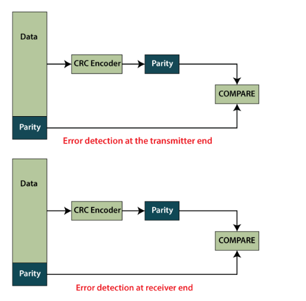

# <center>Lab Program 1</center>
# <center>CRC</center>
<hr>
<div style="font-size:20px"><p>Write a program for error Detecting code using CRC-CCITT [16 bits]</p>
</div>

### <b>Crc.java </b>
```java
import java.io.*;
import java.util.Scanner;

public class Crc {

	public static void main(String[] args) throws IOException{
		// TODO Auto-generated method stub
		Scanner sc =new Scanner(System.in);
		int[] data;
		int[] div;
		int[] divisor;
		int[] rem;
		int[] crc;
		
		int data_bits,divisor_bits,tot_length;
		
		System.out.println("Enter number of data bits: ");
	    data_bits = sc.nextInt();
	    data =new int[data_bits];
	    System.out.println("Enter data bits: ");
	    for(int i=0;i<data_bits;i++)
	    	data[i] = sc.nextInt();
	    
		System.out.println("Enter number of divisor bits: ");
	    divisor_bits = sc.nextInt();
	    divisor = new int[divisor_bits];
	    System.out.println("Enter divisor bits: ");
	    for(int i=0;i<divisor_bits;i++)
	    	divisor[i] = sc.nextInt();
	    
	    System.out.print("Data Bits are: ");
	    for(int i=0;i<data_bits;i++)
	    	System.out.print(data[i]);
	    System.out.println();
	    System.out.println("Divisor Bits are: ");
	    for(int i=0;i<divisor_bits;i++)
	    	System.out.print(divisor[i]);
	    System.out.println();
	    
	    tot_length = data_bits + divisor_bits - 1;
	    
	    div = new int[tot_length];
	    rem = new int[tot_length];
	    crc = new int[tot_length];
	    
	    for(int i=0; i<data.length ;i++)
	    	div[i] = data[i];
	    System.out.println("Dividend (after appending 0's) are: ");
	    for(int i=0; i<div.length ;i++)
	    	System.out.print(div[i]);
	    System.out.println();
	    for(int j=0; j<div.length ;j++)
	    	rem[j] = div[j];
	    
	    rem = divide(div, divisor, rem);
	    
	    for(int i=0;i<div.length;i++) 
	    {
	    	crc[i] = (div[i]^rem[i]);
	    }
	    System.out.println();
	    System.out.println("CRC Code: ");
	    for(int i=0; i<crc.length; i++)
	    	System.out.print(crc[i]);
	    System.out.println();
	    
	    System.out.println("Enter CRC Code of "+tot_length+" bits");
	    for(int i=0; i<crc.length ;i++)
	    	crc[i] = sc.nextInt();
	    for(int j=0; j<crc.length; j++)
	    	rem[j] = crc[j];
	    
	    rem = divide(crc, divisor, rem);
	    
	    for(int i=0;i<rem.length;i++)
	    {
	    	if(rem[i] != 0)
	    	{
	    		System.out.println("ERROR...");
	    		break;
	    	}
	    	if(i == rem.length-1)
	    		System.out.println("NO ERROR...");
	    }
	    
	    System.out.println("THANK YOU !!!");
 	}
	
	static int[] divide(int div[],int divisor[],int[] rem)
	{
		int cur = 0;
		while(true)
		{
			for(int i=0; i<divisor.length; i++)
				rem[cur+i] = (rem[cur+i]^divisor[i]);
			while(rem[cur] == 0 && cur!= rem.length-1)
				cur++;
			if((rem.length-cur)<divisor.length)
				break;
		}
		return rem;
	}
}
```

> OUTPUT : With ERROR
```shell
Enter number of data bits: 
17
Enter data bits: 
1 0 0 0 1 0 0 0 0 0 0 1 0 0 0 0 1
Enter number of divisor bits: 
4
Enter divisor bits: 
1 0 1 1
Data Bits are: 10001000000100001
Divisor Bits are:
1011
Dividend (after appending 0's) are:
10001000000100001000

CRC Code:
10001000000100001100
Enter CRC Code of 20 bits
1 0 0 0 1 0 0 0 0 0 0 1 0 0 0 0 1 0 0 0
ERROR...
THANK YOU !!!
```
> OUTPUT: With NO-ERROR
```shell
Enter number of data bits: 
17
Enter data bits: 
1 0 0 0 1 0 0 0 0 0 0 1 0 0 0 0 1
Enter number of divisor bits: 
4
Enter divisor bits: 
1 0 1 1 
Data Bits are: 10001000000100001
Divisor Bits are:
1011
Dividend (after appending 0's) are:
10001000000100001000

CRC Code:
10001000000100001100
Enter CRC Code of 20 bits
1 0 0 0 1 0 0 0 0 0 0 1 0 0 0 0 1 1 0 0
NO ERROR...
THANK YOU !!!
```
<hr>

<div style="font-size:15px">
<h2>CRC Program description</h2>
<p>
	CRC stands for Cyclic Redundancy Check. It was invented by W. Wesley Peterson in 1961. It is an error detecting technique through which we can detect the error in digital networks(or communication channel or digital data) and storage devices. It is used to trace the accidental changes in the digital data.
	
	CCITT stands for Consultative Committee for International Telephony and Telegraphy
</p>

# <center></center>
___
<p>For example, a single corrupted bit in the data results in a one-bit change in the calculated CRC, but multiple corrupted bits may cancel each other out. If multiple bits are corrupted or changed is known as a burst error.

There is some other error detection mechanism like Vertical Redundancy Check (VRC)and Longitudinal Redundancy Check (LRC), but CRC is more powerful in comparison with others. The algorithm of CRC is more complex because it uses binary division to calculate CRC. The divisor is generated using polynomials. So, CRC is also called polynomial code checksum.</p>
____
<h2>Following are the steps used in CRC for error detection:</h2>
<div>
<ol>In the first step, we append N 0's to the data unit. The value of N is always less than the number of bits in the data unit(referred to as division which is N+1).</ol>
<ol>In the next step, we use the process of binary division for dividing the newly extended data by a divisor, and the reminder which we get from this division is referred to as CRC remainder.</ol>
<ol>In the next step, we replace all the 0's which we append before in the data unit with the remainder bits. After that, we sent the newly generated data unit to the receiver.</ol>
<ol>The receiver receives the data unit with the CRC remainder. After that, the receiver divides the data unit by the divisor.</ol>
<ol>If the remainder is zero after dividing the data unit with the divisor, unit data is not corrupted and can be accepted.</ol>

<ol>If the remainder is not equal to zero after dividing the data unit with the divisor, unit data is corrupted and will be discarded.</ol>
</div>
</div>

> ------
