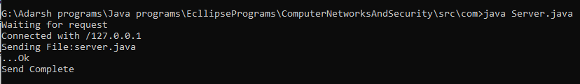
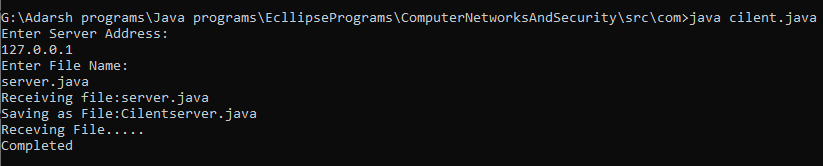
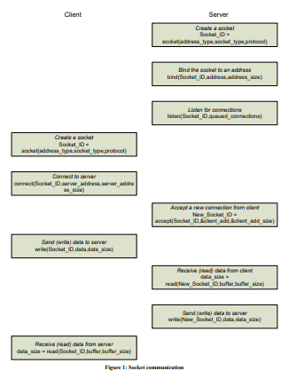

# <center>Lab Program 2</center>
# <center>Cilent Server</center>
<hr>
<div style="font-size:20px"><p>Using TCP/IP Socket write a cilent server Program to make the cilent send the filename and to make server send the filename and to make server back the contents of the requesed file if present.</p>
</div>

### <b>Server.java </b>
```java
package com;

//import java.io.DataInputStream;
//import java.io.DataOutputStream;
//import java.io.File;
//import java.io.FileInputStream;
//import java.net.ServerSocket;
//import java.net.Socket;

import java.io.*;
import java.net.*;

public class Server {

	public static void main(String[] args) throws Exception {
		// TODO Auto-generated method stub
		//Create Server Socket on port 5000
		ServerSocket ss = new ServerSocket(5000);
		System.out.println("Waiting for request");
		Socket s = ss.accept();
		System.out.println("Connected with "+s.getInetAddress().toString());
		DataInputStream din =new DataInputStream(s.getInputStream());
		DataOutputStream dout = new DataOutputStream(s.getOutputStream());
		
		//Reading File name from Cilent.
		String filename = "";
		filename = din.readUTF();
		System.out.println("Sending File:"+filename);
		File f = new File(filename);
		
		FileInputStream fin = new FileInputStream(f);
//		long sz = (int)f.length();
		byte b[]=new byte[1024];
		
		int read;
		while((read=fin.read(b))!=-1)
		{
			//read(byte[] b)reads up to b.length bytes of data from this input stream into an array of bytes.
			dout.write(b,0,read);
			dout.flush();
		}
		fin.close();
		System.out.println("...Ok");
		dout.flush();
		
		dout.writeUTF("stop");
		System.out.println("Send Complete");
		dout.flush();
		
		din.close();
		s.close();
		ss.close();
	}

}
```
<hr>

### <b>cilent.java </b>
```java
package com;

import java.io.BufferedReader;
import java.io.DataInputStream;
import java.io.DataOutputStream;
import java.io.File;
import java.io.FileOutputStream;
import java.io.InputStreamReader;
import java.net.Socket;
import java.util.Scanner;

public class cilent {

	public static void main(String[] args) throws Exception {
		// TODO Auto-generated method stub
		String address="";
		Scanner sc = new Scanner(System.in);
		System.out.println("Enter Server Address:");
		address = sc.nextLine();
		
		Socket s = new Socket(address,5000);
		DataInputStream din = new DataInputStream(s.getInputStream());
		DataOutputStream dout = new DataOutputStream(s.getOutputStream());
		BufferedReader br = new BufferedReader(new InputStreamReader(System.in));
		String filename = "";
		
		//Read the File Name.
		System.out.println("Enter File Name:");
		filename =sc.nextLine();
		sc.close();
		dout.writeUTF(filename);
		
		System.out.println("Receiving file:"+filename);
		filename = "Cilent"+filename;
		System.out.println("Saving as File:"+filename);
		byte b[] = new byte[1024];
		System.out.println("Receving File.....");
		FileOutputStream fos = new FileOutputStream(new File(filename),true);
		long bytesRead;
		
		do
		{
			bytesRead = din.read(b,0,b.length);
			fos.write(b,0,b.length);
		}while(!(bytesRead<1024));
		System.out.println("Completed");
		dout.close();
		s.close();
	}

}
```

### Output:
____
##### Server.java 
# <center></center>
##### cilent.java 
# <center></center>
___

> Click on Cilent Server to know more about cilent server Theory....

[Cilent Server Theory](https://sandilands.info/sgordon/teaching/its332y07s2/protected/ITS332Y07S2L06-Sockets.pdf "Cilent Server Theory")


#### Diagramatic explanation
# <center></center>

> ------

