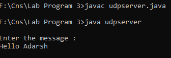
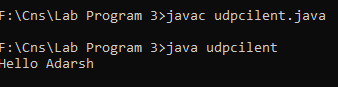

# <center>Lab Program 3</center>
# <center>UDP cilent-server</center>
<hr>
<div style="font-size:20px"><p>Write a program on datagram socket for cilent or server to disply message on client that is typed on server.</p>
</div>

### <b>udpserver.java </b>
```java
import java.io.*;
import java.util.*;
import java.net.*;

public class udpserver 
{
    public static void main(String[] args) throws IOException
    {
        DatagramSocket ds = new DatagramSocket();
        Scanner sc=new Scanner(System.in);
        String str = "";
        System.out.println("\nEnter the message : ");
        str = sc.nextLine();
        InetAddress ip = InetAddress.getByName("127.0.0.1");
        DatagramPacket dp =new DatagramPacket(str.getBytes(),str.length(),ip,3000);
        ds.send(dp);
        ds.close();
    }
}
```
<hr>

### <b>udpcilent.java </b>
```java
import java.util.*;
import java.io.*;
import java.util.Scanner;
import java.net.*;

public class udpcilent 
{
    public static void main(String[] args) throws IOException
    {
        DatagramSocket ds = new DatagramSocket(3000);
        byte[] buf = new byte[1024];
        DatagramPacket dp = new DatagramPacket(buf, 1024);
        ds.receive(dp);
        String str = new String(dp.getData(),0,dp.getLength());
        System.out.println(str);
        ds.close();
    }
}

```

<h2>Short description of UDP Client Server:</h2>
<p>DatagramSockets are Java’s mechanism for network communication via UDP instead of TCP. Java provides DatagramSocket to communicate over UDP instead of TCP. It is also built on top of IP. DatagramSockets can be used to both send and receive packets over the Internet.

One of the examples where UDP is preferred over TCP is the live coverage of TV channels. In this aspect, we want to transmit as many frames to live audience as possible not worrying about the loss of one or two frames. TCP being a reliable protocol add its own overhead while transmission.
Another example where UDP is preferred is online multiplayer gaming. In games like counter-strike or call of duty, it is not necessary to relay all the information but the most important ones. It should also be noted that most of the applications in real life uses careful blend of both UDP and TCP; transmitting the critical data over TCP and rest of the data via UDP.

This article is a simple implementation of one-sided client-server program wherein the client sends messages to server and server just prints it until the client sends “Hello Adarsh”.</p>

### Output:
____
##### Server.java 
# <center></center>
##### cilent.java 
# <center></center>

> ------

#### we can summarize the steps of sending and receiving data over UDP as follows:-

1. For sending a packet via UDP, we should know 4 things, the message to send, its length, ipaddress of destination, port at which destination is listening.
2. Once we know all these things, we can create the socket object for carrying the packets and packets which actually possess the data.
3. Invoke send()/receive() call for actually sending/receieving packets.
4. Extract the data from the received packet.

_______
>NOTE:
 In order to test the above programs on the system, Please make sure that you run the server program first and then the client one. Make sure you are in the client console and from there keep on typing your messages each followed with a carriage return. Every time you send a message you will be redirected to the server console depending on your environment settings. If not redirected automatically, switch to server console to make sure all your messages are received. Finally to terminate the communication, type "Hello Adarsh" (without quotes) and hit enter.

