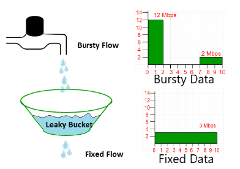
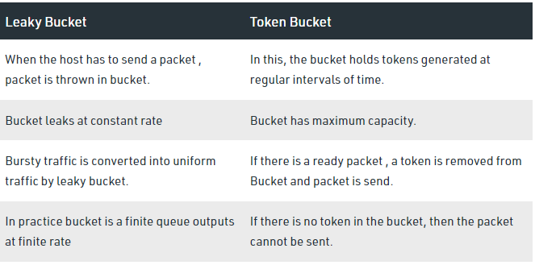

# <center>Lab Program 5</center>
# <center>Leaky Bucket Algorithm</center>
<hr>
<div style="font-size:20px"><p>Write an program for RSA Algorithm for generation of public and private keys.</p>
</div>

### <b>LeakyBucket.java </b>
```java
import java.io.*;
import java.util.*;

class Queue
{
    int q[],f=0,r=0,size;
    void insert(int n)
    {
        Scanner sc = new Scanner(System.in);
        q = new int[10];
        for(int i=0;i<n;i++)
        {
            System.out.print("\nEnter "+i+" element: ");
            int ele = sc.nextInt();
            if(r+1>5)
            {
                System.out.println("\nQueue is Full\nLost Packet: "+ele);
                break;
            }
            else
            {
                r++;
                q[i] = ele;   
            }
        }
    }
    void delete()
    {
        Scanner sc = new Scanner(System.in);
        Thread t = new Thread();
        if(r == 0)
            System.out.println("\nQueue Empty.");
        else
        {
            for(int i=f;i<r;i++)
            {
                try
                {
                    t.sleep(36000);
                }
                catch(Exception e){}
                System.out.print("\nLeaked Packet: "+q[i]);
                f++;
            }
        }
        System.out.println();
        }
}

class LeakyBucket extends Thread
{
    public static void main(String[] args) 
    {
        Queue q = new Queue();
        Scanner sc = new Scanner(System.in);
        System.out.println("\nEnter the packets to be sent: ");
        int size = sc.nextInt();
        q.insert(size);
        q.delete();
    }
}
```

> OUTPUT : 
```shell
Enter the packets to be sent: 
1000

Enter 0 element: 200

Enter 1 element: 700

Enter 2 element: 500

Enter 3 element: 450

Enter 4 element: 400

Enter 5 element: 200

Queue is Full
Lost Packet: 200

Leaked Packet: 200
Leaked Packet: 700
Leaked Packet: 500
Leaked Packet: 450
Leaked Packet: 400
```

<h2>Short description of Leaky Bucket Algorithm:</h2>
<p>In the network layer, before the network can make Quality of service guarantees, it must know what traffic is being guaranteed. One of the main causes of congestion is that traffic is often bursty. 

To understand this concept first we have to know little about traffic shaping. Traffic Shaping is a mechanism to control the amount and the rate of traffic sent to the network. Approach of congestion management is called Traffic shaping. Traffic shaping helps to regulate the rate of data transmission and reduces congestion.

### There are 2 types of traffic shaping algorithms: 

1. Leaky Bucket
2. Token Bucket</p>

### Explanation :
Suppose we have a bucket in which we are pouring water, at random points in time, but we have to get water at a fixed rate, to achieve this we will make a hole at the bottom of the bucket. This will ensure that the water coming out is at some fixed rate, and also if the bucket gets full, then we will stop pouring water into it.

# <center></center>

The input rate can vary, but the output rate remains constant. Similarly, in networking, a technique called leaky bucket can smooth out bursty traffic. Bursty chunks are stored in the bucket and sent out at an average rate.

#### we can summarize the steps of LeakyBucket Algo:-
A simple leaky bucket algorithm can be implemented using FIFO queue. A FIFO queue holds the packets. If the traffic consists of fixed-size packets (e.g., cells in ATM networks), the process removes a fixed number of packets from the queue at each tick of the clock. If the traffic consists of variable-length packets, the fixed output rate must be based on the number of bytes or bits.

The following is an algorithm for variable-length packets:  

1. Initialize a counter to n at the tick of the clock.
2. Repeat until n is smaller than the packet size of the packet at the head of the queue.
3. Pop a packet out of the head of the queue, say P.
4. Send the packet P, into the network 
5. Decrement the counter by the size of packet P.
6. Reset the counter and go to step 1.

# <center></center>

_______
### Some advantage of token Bucket over leaky bucket

1. If a bucket is full in tokens Bucket, tokens are discard not packets. While in leaky bucket, packets are discarded.
2. Token Bucket can send large bursts at a faster rate while leaky bucket always sends packets at constant rate.

_____
